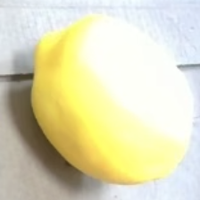

# qwen3-vl-ONNX-TensorRT: Image-to-Text Inference Model


## Overview
This repository provides the ONNX-converted version of the **qwen3-vl** multimodal model, optimized for efficient image-to-text generation. The model supports inference on single images with a fixed input resolution of 224×224 and outputs descriptive text based on visual content. Tested 2b and 4b, theoretically supporting all VLMs for Qwen3-VL.

## Key Features
- **Model Type**: ONNX-exported multimodal large language model (vision-language)
- **Input Specification**: Single RGB image (224×224 resolution, 3 channels)
- **Output**: High-quality natural language description of the input image
- **Conversion Source**: Original qwen3-vl-2b (PyTorch) → ONNX format

## Inference Example
### Input


- **Version**: Single RGB image (224×224) of a lemon.
- **Language**: Describe this image.

### Output
```
This image shows a single, yellow, spherical object that appears to be a small, smooth, and rounded lemon. It is placed on a light-colored, possibly white or off-white, surface with a wood grain texture. The lemon has a rounded, slightly flattened top and a smooth surface. The lighting is even, and the object is the central focus of the image.
```

## Requirements
- Will be supplemented.

## Next task
- Adapt images of different sizes
- ✅ Comparison of Test Torch and ONNX inference Speed
- ✅ Convert ONNX to TensorRT to further improve inference speed
- Convert more models from Torch to ONNX
- Using cache for extreme inference speed


## Usage
### 1. Download Qwen3-VL
```bash
# Download the model
hf download Qwen/Qwen3-VL-2B-Instruct --local-dir=.
```

### 2. Conert Torch to ONNX
```bash
python qwen3_vl_export_onnx.py
```

### 3. Run Inference with ONNX Runtime
```bash
python inference_onnx.py
```

## Model Conversion Notes
- The ONNX model is exported from the original PyTorch implementation of qwen3-vl.
- Input resolution is fixed at 224×224 (consistent with the model's training configuration).
- For optimal performance, use ONNX Runtime with GPU acceleration (install `onnxruntime-gpu` instead of `onnxruntime`).
- The model retains the original qwen3-vl's visual understanding and text generation capabilities.

## Performance
- Will be supplemented.
- **Latency**: Using qwen's forward and ONNX inference for a thousand times:
  
  Torch(fp32) speed time:  44.46 (s), ONNX (fp32) speed time:  26.78 (s), ONNX (fp16) speed time:  18.13 (s), 
- **Speed**:
Qwen3-vl Generated tokens nums:1103, speed:  19.378385 tokens/sec
ONNX Generated tokens nums:1062, speed:  38.667467 tokens/sec
Tensorrt Generated tokens nums:842, speed:  66.579019 tokens/sec

- **Accuracy**: 
- **Memory Usage**:


## License
The model is licensed under the same license as the original qwen3-vl-2b (see [Qwen Official Repository](https://github.com/QwenLM/Qwen) for details).

## Acknowledgements
- Original qwen3-vl-2b model developed by Alibaba Cloud.
- ONNX conversion leverages PyTorch's `torch.onnx.export` API and ONNX Runtime for inference optimization.
